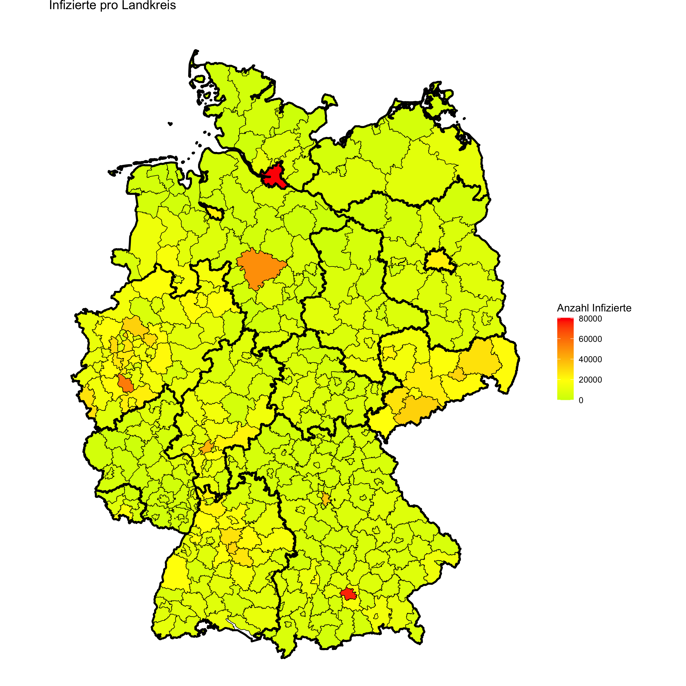
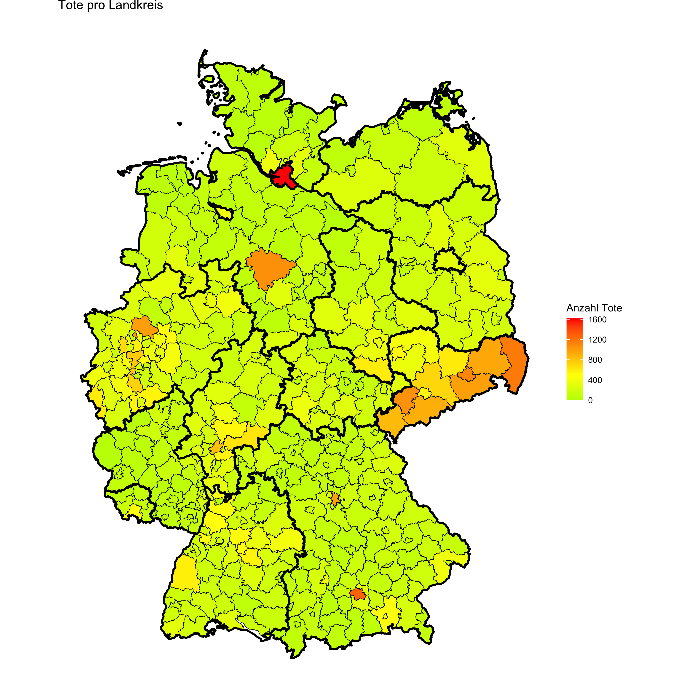

```{r, include = FALSE}
knitr::opts_chunk$set(
  collapse = TRUE,
  comment = "#>",
  fig.width=12, fig.height=12
)
```

Das COVID-Project ist ein Package, welches dem Nutzer aktuelle Daten des Robert-Koch-Instituts zur Coronapandemie zur Verfügung stellt. Die Datentabelle wird anhand der Anforderungen des Nutzers neu gefiltert und Daten werden aggregiert, um dem Nutzer spezifische Fragen zu den Coronazahlen zu beantworten. Zudem können die Daten in verschiedensten Plots dargestellt werden.

# Setup

Führe den untenstehenden Befehl aus, um das Package zu laden.

```{r setup}
library(covidproject)
library(dplyr)
```

Zudem muss zu Beginn einmal die Datentabelle des Robert-Koch-Instituts heruntergeladen werden:

```{r load_covid_data}


dir_path <- system.file("extdata", package="covidproject")

# aus Performanzgründen laden wir hier direkt die .csv datei
#data_downloader("path...")
cov_data <- read.csv(paste0(dir_path, "/data.csv"))

print(cov_data)
```

# Filter functions

Die *filter functions* dienen dazu, die umfangreiche Datentabelle des Robert-Koch-Instituts, welche alle Fälle seit Beginn der Pandemie führt, zu filtern und Daten zu aggregieren.

## get-Methoden

Jede *get\_...-Methode* gibt eine neue Datentabelle zurück, die dem Nutzer genau die gewünschte Information aufzeigt. Folgende Eingabeparameter kann der Nutzer variieren:

-   *age_group_start*: Ab welchem Alter will man Ergebnisse sehen
-   *age_group_end*: Bis zu welchem Alter will man Ergebnisse sehen
-   *date_start*: Ab welchem Datum will man Ergebnisse sehen
-   *date_end*: Bis zu welchem Datum will man Ergebnisse sehen
-   *federal_state* oder *district*: Je nach Methode, welche Bundesländer bzw. Landkreise will man sehen

Mit der Methode *get_deaths_per_federal_state* kann man sich zum Beispiel Todeszahlen zu einzelnen Bundesländern anzeigen lassen.

```{r get_deaths_per_federal_state}
deaths_bayern_hessen <- get_deaths_per_federal_states(cov_data, date_start = "2020/06/01", date_end = "2020/12/01", federal_state = c("Bayern", "Hessen"))

print(deaths_bayern_hessen)
```

Hier wird eine Tabelle mit der Anzahl von Todesfällen in Bayern und Hessen im Zeitraum vom 1. Juni 2020 bis 1. Dezember 2020 ausgegeben. Es werden hierbei alle Altersgruppen betrachtet, da diese nicht mittels der Parameter eingeschränkt wurden. Weitere Beispiele gibt es mit der Funktion *covidproject::examples*.

## Inzidenz

Mit der Methode *get_incidence_per_district* kann man sich die Inzidenz für bestimmte Landkreise anzeigen lassen. Die Inzidenz gibt an, wie viele Neuinfektionen pro 100.000 Einwohner in einer gewissen Zeitspanne gab. In der Regel liegt diese bei 7 Tagen, man kann sie aber mithilfe vom Parameter *incidence_days* variieren.

```{r incidence}
incidence_flensburg_kiel <- get_incidence_per_district(cov_data, district = c("SK Flensburg", "SK Kiel"), date_start = "2020/04/01", date_end = "2021/04/01")

print(incidence_flensburg_kiel)
```

## Unclean Data

Teilweise gibt es in der Datentabelle Daten, die fehlerhaft oder unvollständig sind und die mit diesen Funktionen entfernt werden können. Hierzu zählen:

-   Der Fall war nur in der Publikation des Vortages enthalten
-   Der Fall ist jetzt kein Todesfall mehr, obwohl er es in vorigen Publikationen war
-   Der Fall ist jetzt nicht mehr genesen, obwohl er es in vorigen Publikationen war
-   Die Altersgruppe des Falls ist unbekannt

```{r unclean_data}
unclean_data <- get_unclean_data(cov_data)
clean_data <- remove_unclean_data(unclean_data)
print(unclean_data)
```

# Plot functions

Die *plot functions* dienen dazu die neu generierten Datentabellen grafisch darzustellen. Hierbei muss der Nutzer keine weiteren Parameter angeben. Die Funktion findet automatisch zu jeder Tabelle den passenden Plot.

Um die Beispieltabelle von oben zu plotten, kann ganz einfach folgender Befehl ausgeführt werden:

```{r plot_deaths}
plot_function(deaths_bayern_hessen)
```

# Fragestellungen

## Fallsterblichkeit

Die Fallsterblichkeit gibt den Anteil an Todesfällen pro entdecktem Infektionsfall an. An der Fallsterblichkeit lässt sich erkennen wie todesgefährlich eine Krankheit ist. Mit der Funktion *get_fallsterblichkeit_overall* lässt sich ein Dataframe erstellen, welches den Verlauf der Fallsterblichkeit über den gesamten Coronazeitraum darstellt. Hierbei ist es möglich mithilfe von Parametern die Altersgruppen einzuschränken.

```{r fallsterblichkeit}
fallsterblichkeit <- get_fallsterblichkeit_overall(cov_data)
plot_function(fallsterblichkeit)
```

Die Fallsterblichkeit weist einen starken Spike zu Anfang des Jahres 2020 auf, bleibt danach jedoch niedrig. Es ist eine Saisonalität zu erkennen (niedrigere Fallsterblichkeit im Sommer).

## Forecasting

Mit der Funktion *predict_future_progress* wird versucht eine zukünftige Prognose für Coronazahlen zu geben. Mithilfe einer Zeitreihe aus den Daten und einem Prophet-Model, werden Daten prognostiziert. Mit dem Parameter *future_days* lässt sich angeben, wie viele Tage man in die Zukunft sehen möchte. Im folgenden Beispiel wird die Zukünftige Entwicklung der täglichen Infektionszahlen, bzw. Todesfälle für ganz Deutschland für die nächsten zwei Jahre vorhergesagt:

```{r predict_future_progress Todesfälle}
infection_data <- get_deaths_per_federal_states(cov_data, date_start = "2020/06/01", date_end = "2021/08/07")
predict_future_progress(infection_data, future_days = 730)


```

```{r predict_future_progress Infektionen}
infection_data <- get_infections_per_federal_states(cov_data, date_start = "2020/06/01", date_end = "2021/08/07")
predict_future_progress(infection_data, future_days = 730)
```

Es ist erkennbar, dass das Model leicht sinkende Todesfälle vorhersagt. Interessanterweise ist dies für Infektionen nicht der Fall. Hier werden steigende Zahlen über die Jahre vorhergesehen. Es ist anzumerken, dass die Vorhersagen nur auf den historischen Fallzahlen und der Annahme, dass jährliche Saisonalität bei den Verläufen vorliegt, basieren.

## Erkrankungsdatum

Um zu vergleichen für wie viele Fälle das Erkrankungsdatum bekannt ist, kann man sich mit der Methode *get_infections_overall* die Summe dieser Fälle ausgeben lassen. Hierfür ist in der Datentabelle des Robert-Koch-Instituts eine Zeile verfügbar, die genau diesen Sachverhalt bestimmen lässt. Um die Zahl mit der Gesamtzahl zu vergleichen nutzt man die bereits bekannten *get_infections\_...-Methoden*, um das zugehörige Dataframe zu erzeugen.

```{r erkrankungsdatum}
infections_with_date <- get_infections_overall(cov_data)
infections_all <- get_infections_per_federal_states(cov_data)
infections_with_date %>% 
  summarise(Faelle_gesamt = sum(Infections)) -> infections_with_date
print(paste("# Datum bekannt:", infections_with_date$Faelle_gesamt[1]))
```

## Vergleich von Landkreisen

Um einen Überblick über das Pandemiegeschehen in Deutschland zu erhalten, plotten wir zunächst die bisherigen Infektionsfälle, sowie Todesfälle je Landkreis.

(Da der erzeugte Plot nicht innerhalb einer Vignette angezeigt werden kann, zeigen wir hier den zuvor gespeicherten Output.)

```{r Map of Infections}
#cov_data %>%
#  distinct(Landkreis) -> landkreise
#landkreise <- landkreise$Landkreis

#infections_per_district <- get_infections_per_district(cov_data, district = landkreise)

#plot_district_map(infections_per_district)
```



```{r Map of Deaths}

#deaths_per_district <- get_deaths_per_district(cov_data, district = landkreise)

#plot_district_map(deaths_per_district)
```



Man kann erkennen, dass Infektionen, aber besonders Todesfälle in Landkreisen Sachsens im Verlauf der Pandemie vergleichsweise häufig waren.

Mit der Methode *get_correlation_for_incidence_pairs* lässt sich die Korrelation der Inzidenzen zwischen zwei Landkreisen berechnen. Man kann schauen wie sehr die einzelnen Inzidenzen von verschiedenen Landkreisen im Zusammenhang stehen.

```{r correlations}
incidences <- get_incidence_per_district(cov_data, date_start = "2020/04/01", date_end = "2021/04/01")
correlations <- get_correlation_for_incidence_pairs(incidences)

plot_incidence_correlations_barchart(correlations)
```

Für einige dieser Landkreise möchten wir eine Korrelationsmatrix darstellen:

```{r}
plot_incidence_correlations_matrix(correlations, districts=c("SK Bochum", 
                                                             "LK Rhein-Sieg-Kreis",
                                                             "SK Dortmund",
                                                             "LK Minden-Lübbecke",
                                                             "SK Oberhausen",
                                                             "LK Main-Kinzig-Kreis",
                                                             "LK Wesel"))
```

Es zeigt sich, dass Landkreise mit sehr hoher Korrelation der Inzidenzen auch geographisch nahe zueinander liegen. Außerdem weisen die Top-7 Landkreispaare mit den stärksten Korrelationen hohe Korrelationen untereinander auf.

## Wetter

Oft wird behauptet, die Coronazahlen hingen stark von dem Wetter ab. Es wird davon ausgegangen, das Virus verbreite sich schlechter bei warmem Wetter. Mithilfe des Parameters *add_weather* in der *plot_function* kann man sich die zugehörige Durchschnittstemperatur für den bestimmten Zeitraum einzeichnen lassen. So kann untersucht werden, ob das Wetter Einfluss auf die Coronazahlen hat.

```{r weather}
infections_data <- get_infections_per_federal_states(cov_data, date_start = "2020/03/01", date_end = "2021/03/01")
#infections_bayern_hessen <- get_infections_per_federal_states(cov_data, date_start = "2020/06/01", date_end = "2020/12/01", federal_state = c("Bayern", "Hessen"))
plot_function(infections_data, add_weather = TRUE)
```

Es ist erkennbar, dass bei hohen Temperaturen die Infektionszahlen niedrig sind.
